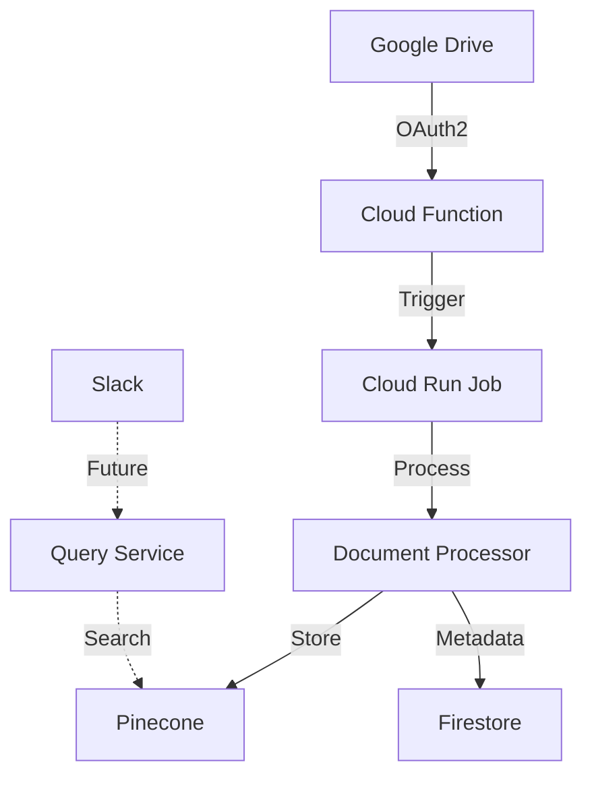

# Semantic Document Indexer Service

A service to process and index documents from Google Drive using Retrieval Augmented Generation (RAG) techniques. This service integrates with Slack to enable document querying through chat interface.

## Features

- OAuth2 integration with Google Drive
- Document processing with contextual RAG
- Vector storage using Pinecone
- Metadata storage in Firestore
- Hybrid search (Vector + BM25)
- Slack integration (in development)

## Architecture



## Prerequisites

- Python 3.9+
- Docker
- Google Cloud Project
- Pinecone Account
- OpenAI API Key
- Anthropic API Key

## Required Credentials

1. **Google OAuth**:
   - Client ID
   - Client Secret
   - Redirect URI configuration
   - Service Account key (for Google Cloud services)

2. **AI Services**:
   - OpenAI API Key (for embeddings)
   - Anthropic API Key (for context generation)

3. **Vector Database**:
   - Pinecone API Key
   - Environment
   - Index name

## Environment Setup

Create a `.env` file:

```bash
# Google Cloud Settings
PROJECT_ID=your-project-id
REGION=us-central1
GOOGLE_APPLICATION_CREDENTIALS=credentials/credentials.json

# Google OAuth Settings
GOOGLE_CLIENT_ID=your-client-id.apps.googleusercontent.com
GOOGLE_CLIENT_SECRET=GOCSPX-your-client-secret
OAUTH_REDIRECT_URI=http://localhost:8080/auth/google/callback

# OpenAI Settings
OPENAI_API_KEY=your-openai-key

# Anthropic Settings
ANTHROPIC_API_KEY=your-anthropic-key

# Vector DB Settings (Pinecone)
PINECONE_API_KEY=your-pinecone-key
PINECONE_ENVIRONMENT=us-east-1
PINECONE_INDEX_NAME=your-index-name

# Application Settings
APP_PORT=8080
CHUNK_SIZE=1000
CHUNK_OVERLAP=200
```

## Installation & Running

1. **Build the Docker image**:
```bash
docker build -t document-indexer --no-cache .
```

2. **Run the container**:
```bash
docker run -p 8080:8080 \
  --env-file .env \
  -v $(pwd)/credentials:/app/credentials \
  document-indexer
```

## Authentication Flow

1. Open in browser:
```
http://localhost:8080/auth/google
```

2. Complete Google OAuth consent
3. Note the user_id from the callback response

## API Endpoints

### Process Document
```bash
curl -X POST http://localhost:8080/process \
  -H "Content-Type: application/json" \
  -d '{
    "file_id": "your-google-drive-file-id",
    "user_id": "test_user"
  }'
```

### Check Status
```bash
curl http://localhost:8080/status/{document_id}
```

### Health Check
```bash
curl http://localhost:8080/health
```

## Current Project Status

### Completed
- ✅ Basic project structure
- ✅ Google OAuth integration
- ✅ Document processor setup
- ✅ Vector store integration
- ✅ Metadata storage

### In Progress
- 🔄 Document processing implementation
- 🔄 Authentication flow testing
- 🔄 Error handling improvements

### Pending
- ⏳ Slack integration
- ⏳ User management
- ⏳ Web interface
- ⏳ Analytics dashboard

## Known Issues
1. OAuth flow needs complete testing
2. Error handling needs improvement
3. User management is simplified (using "test_user")

## Next Steps
1. Complete document processing implementation
2. Add proper user management
3. Implement Slack integration
4. Create web interface for monitoring
5. Add comprehensive testing

## Project Structure
```
document-indexer-service/
├── app/
│   ├── auth/                 # OAuth and authentication
│   ├── processor/            # Document processing
│   ├── database/            # Database operations
│   ├── models/              # Data models
│   └── config/              # Configuration
├── scripts/                 # Deployment scripts
├── tests/                  # Test files
└── docs/                   # Documentation
```

## Contributing
Currently in development phase. Contribution guidelines will be added soon.

## License
[Add your license information]

## Support
For support, please [add contact information]

## Acknowledgments
- LangChain for RAG implementation
- Google Cloud Platform
- OpenAI and Anthropic for AI models
- Pinecone for vector storage