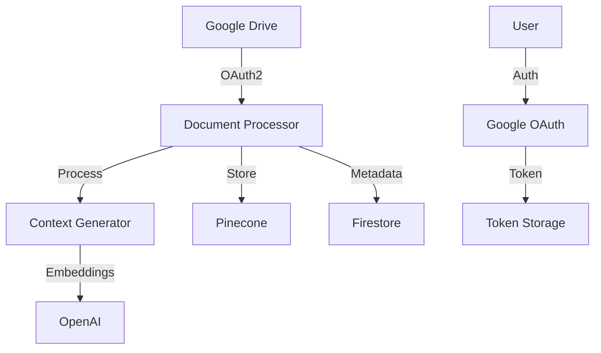

# Semantic Document Indexer Service

A service that processes and indexes documents from Google Drive using Retrieval Augmented Generation (RAG) techniques. The service implements contextual RAG for better document understanding and retrieval accuracy.

## Features

- OAuth2 Google Drive integration
- Contextual RAG processing
- Vector storage with Pinecone
- Metadata storage in Firestore
- Document chunking and context generation
- Asynchronous processing
- User authentication and token management

## Architecture



## Prerequisites

- Python 3.9+
- Docker
- Google Cloud Project
- Pinecone Account
- OpenAI API Key
- Anthropic API Key

## Environment Setup

Create a `.env` file:

```bash
# Google Cloud Settings
PROJECT_ID=your-project-id
REGION=us-central1
GOOGLE_APPLICATION_CREDENTIALS=credentials/credentials.json

# Google OAuth Settings
GOOGLE_CLIENT_ID=your-client-id.apps.googleusercontent.com
GOOGLE_CLIENT_SECRET=GOCSPX-your-client-secret
OAUTH_REDIRECT_URI=http://localhost:8080/auth/google/callback

# OpenAI Settings
OPENAI_API_KEY=your-openai-key

# Anthropic Settings
ANTHROPIC_API_KEY=your-anthropic-key

# Vector DB Settings (Pinecone)
PINECONE_API_KEY=your-pinecone-key
PINECONE_ENVIRONMENT=us-east-1
PINECONE_INDEX_NAME=your-index-name

# Application Settings
APP_PORT=8080
CHUNK_SIZE=1000
CHUNK_OVERLAP=200
```

## Project Structure

```
document-indexer-service/
├── app/
│   ├── auth/                    # Authentication handlers
│   │   ├── google_auth.py      # Google OAuth implementation
│   │   └── token_storage.py    # Token management
│   ├── processor/              # Document processing
│   │   ├── document_processor.py
│   │   ├── chunk_processor.py
│   │   └── context_generator.py
│   ├── database/              # Database operations
│   │   ├── vector_store.py    # Pinecone integration
│   │   └── metadata_store.py  # Firestore operations
│   ├── models/                # Data models
│   │   └── metadata.py
│   └── config/               # Configuration
│       └── settings.py
├── credentials/             # Service account credentials
├── scripts/                # Deployment scripts
└── tests/                  # Test files
```

## Installation

1. Clone the repository:
```bash
git clone https://github.com/your-repo/document-indexer-service.git
cd document-indexer-service
```

2. Create and configure credentials:
```bash
mkdir -p credentials
# Add your Google Cloud credentials.json to credentials/
```

3. Build Docker image:
```bash
docker build -t document-indexer --no-cache .
```

4. Run the service:
```bash
docker run -p 8080:8080 \
  --env-file .env \
  -v $(pwd)/credentials:/app/credentials \
  document-indexer
```

## API Endpoints

### Authentication
```bash
# Start OAuth flow
GET /auth/google

# OAuth callback
GET /auth/google/callback
```

### Document Processing
```bash
# Process a document
POST /process
{
    "file_id": "google-drive-file-id",
    "user_id": "user-id"
}

# Check processing status
GET /status/{document_id}

# Health check
GET /health
```

## Usage Flow

1. Start authentication:
```bash
# Open in browser
http://localhost:8080/auth/google
```

2. After authentication, process a document:
```bash
curl -X POST http://localhost:8080/process \
  -H "Content-Type: application/json" \
  -d '{
    "file_id": "your-file-id",
    "user_id": "test_user"
  }'
```

3. Check processing status:
```bash
curl http://localhost:8080/status/{document_id}
```

## Configuration

### Pinecone Setup
- Create an index with dimension 3072 (for text-embedding-3-large)
- Use cosine similarity metric
- Configure proper environment and region

### Google Cloud Setup
- Enable Drive API
- Create OAuth 2.0 credentials
- Configure redirect URIs
- Enable Firestore

## Development Status

### Implemented
- ✅ Google OAuth integration
- ✅ Document processing
- ✅ Context generation
- ✅ Vector storage
- ✅ Metadata management

### In Progress
- 🔄 Error handling improvements
- 🔄 Progress tracking
- 🔄 Rate limiting

### Planned
- ⏳ Batch processing
- ⏳ Progress notifications
- ⏳ User management

## Testing

```bash
# Run tests
python -m pytest tests/
```

## Contributing

1. Fork the repository
2. Create your feature branch
3. Commit your changes
4. Push to the branch
5. Create a Pull Request

## License

[Add your license]

## Support

For support, please [add contact information]

## Acknowledgments

- LangChain for RAG implementation
- OpenAI for embeddings
- Anthropic for context generation
- Google Cloud Platform
- Pinecone for vector storage